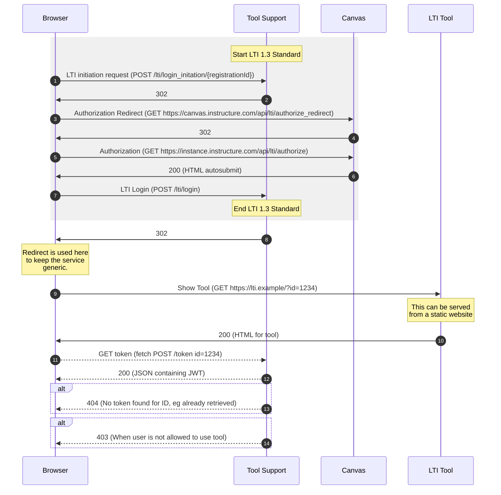
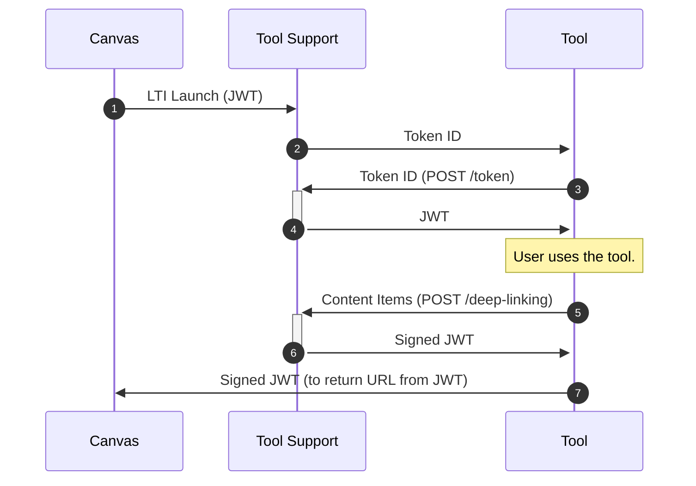
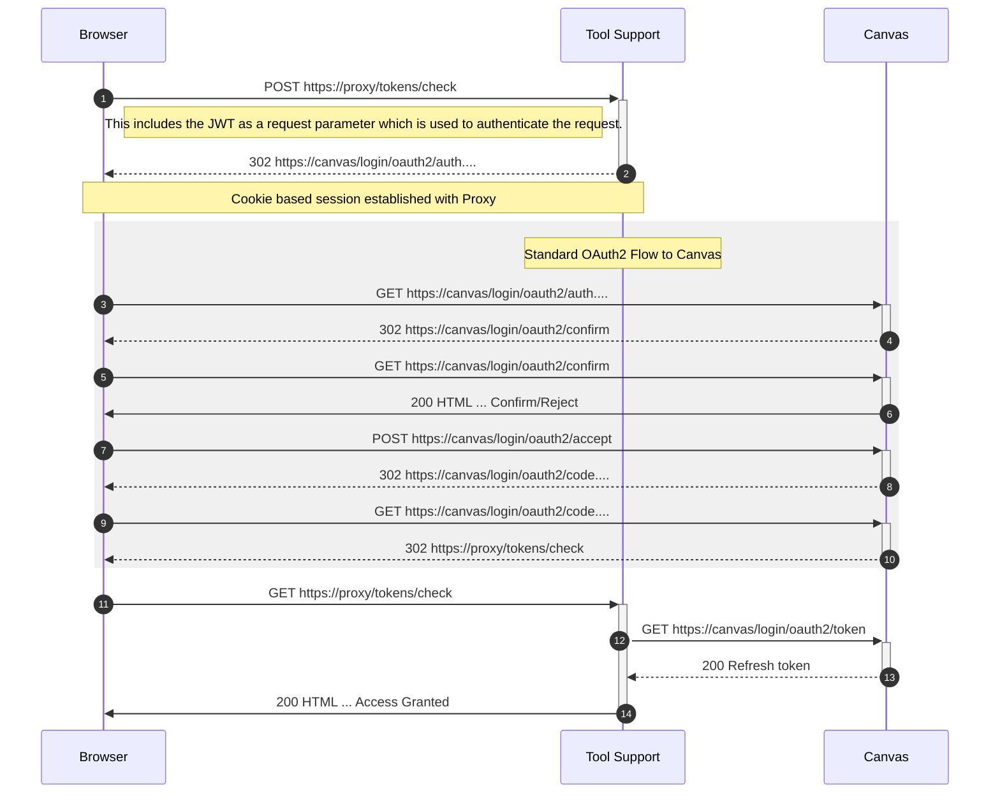

# Canvas Tool Support

[](https://github.com/oxctl/canvas-proxy/actions/workflows/build.yml)

## Overview

This is a webapp that supports LTI tools in Canvas. It handles the LTI 1.3 launch and allows tools to retrieve the JWT that is created through the LTI launch. It also allows the management of OAuth2 tokens for accessing Canvas and links them to a LTI tool. This allows a HTML/JS (React) page to get data about the LTI launch and then make `fetch()` requests to Canvas through this tool. This allows a completely static tool that still provides useful functionality. The webapp supports multiple LTI tool at the same time.

## History

Originally this project was 2 projects, one handling the LTI launch, and one handling the OAuth2 proxying to Canvas. This made configuring a new setup more complex (2 services changed) and also made hosting more expensive. When we were looking at allowing configuration to be edited dynamically we decided that the best solution would be to merge the two projects into one and then the configuration can be edited in just one place.

## Design

### LTI Tool Launch

This is when a user in a service like Canvas click on the link to launch an LTI tool (or it may be in an iframe so launched when the page loads). The launch is designed to pass across information about who the current user is and where in the LMS/VLE they are in a secure way so that the integrated functionality can present them with some functionality.

The easiest way to understand what's happening is with a sequence diagram:



#### Audience Validation

As there isn't a secret that is needed to configure the tool we must do audience validation so that only allowed services can perform a LTI launch. Generally the final endpoint that gets a JWT as authentication should be doing the audience validation, but it may be helpful to also allow it to be done at the point of the LTI launch.

### LTI Names and Roles Provisioning Service

This service supports clients using the JWT created as part of the LTI authentication flow to make Names and Roles Provisioning Service (NRPS) requests to `/nrps/` supplying the JWT as a Bearer in the Authorization header. If the tool has the NRPS service enable then a request will be made to the NRPS endpoint and then if there are any further pages of responses these will be retrieved as well and returned to client in a single response.

The ability to use this endpoint is controlled by configuration which specifies which roles are allowed to use the NRPS. This is because typically you don't want student roles to be able to use this endpoint as it supplies details that may be hidden from them (eg email address). Multiple roles can be specified separated by commas.

### LTI Deep Linking

There is support in the LTI Server to sign deep linking responses before they get sent back to Canvas. This is so that static tools (without a server side component) can sign a JWT for the deep linking response. The specification for this is at: https://www.imsglobal.org/spec/lti-dl/v2p0

The launch flow should be very similar to a normal LTI launch, however once the tool has enough information to send the data back to Canvas it can use the deep linking endpoint to get a signed JWT:



The deep linking endpoint takes the JSON that would normally be included in the content items section of the JWT.

### Example usage

This is how it is implemented in calendar import:

```js
const url = this.props.ltiServer + '/deep-linking'

const body = {
  "https://purl.imsglobal.org/spec/lti-dl/claim/content_items": [{
    "type": "ltiResourceLink",
    "title": this.state.pageName,
    "url": this.props.targetLinkUri,
    "custom": {
      "url": this.state.url
    }
  }]
}

fetch(
  url,
{
    method: 'POST',
    body: JSON.stringify(body),
    headers: new Headers({
      'Content-Type': 'application/json',
      'Authorization': 'Bearer ' + this.props.token
    })
  }
).then((response) => {
  if (!response.ok) {
    throw Error("" + response.status);
  }
  return response.json()
}).then((json) => {
  this.setState({deepLinkingJwt: json['jwt']})
  document.getElementById('deepLinkingForm').submit();
})
```

A fetch POST is made to the deep-linking endpoint  e.g. 'https://lti.canvas.ox.ac.uk/deep-linking'. The body is a JSON object comprised of the content_items claim with a type of "ltiResourceLink". The url is the claim returned from target_link_uri, and any additional contents are in the custom parameter.
This returns a jwt which is then auto-submitted to the url from https://purl.imsglobal.org/spec/lti-dl/claim/deep_linking_settings.deep_link_return_url in a form

```js
<form name="deepLinkingForm" id="deepLinkingForm" method="post" action={this.props.deepLinkReturnUrl}>
  <input type="hidden" name="JWT" value={this.state.deepLinkingJwt} />
</form>
```


### Proxy Use

The proxy allows a tool to make requests to Canvas (eg please list all the courses the current user has) using the browser fetch API, if it doesn't have a token for the user then it returns an error and the tool at this point can prompt the user to start the OAuth2 flow to grant access. Requests to the proxy normally include the JWT from the LTI launch and this is used to work out which developer key should be used (each LTI can optionally have a API key linked to it).

#### Renewing a token

The endpoint (badly named) to renew a token for a user is `POST /tokens/check`, this attempts to remove the existing token for a user and then gets them to re-grant access to the application. The sequence is as follows:



#### Server to Server

We also support serverside services having a shared secret key to sign requests (with HMAC) and this allows the services to perform requests on behalf of a user once the JWT from the LTI launch has expired. As there is no user present for these requests if the token doesn't exist for the user there is no way to prompt them to grant access again.

## Deployment Configuration

### AWS Elastic Beanstalk

This application needs a database to store the configuration and the OAuth tokens it gets granted. We have enabled swap on the instance so for test instances we can use low memory machines and still be able to deploy new version without running out of memory.

#### Environmental Variables

- HOSTNAME - The hostname that the server is running on, used to get TLS/config files.
- LTI_ISSUER - The issuer of JWT tokens that we sign.
- RDS_HOSTNAME - The MySQL hostname to connect to for the database.
- RDS_PORT - The MySQL port to use in the connection to the database.
- RDS_DB_NAME - The name of the MySQL database to use. 
- SECRET_RDS - The name of the secret to get the RDS connection from.
- SENTRY_DSN - The secret for reporting errors and performance to https://sentry.io
- SENTRY_ENVIRONMENT - The environment key that is sent to https://sentry.io
- SPRING_PROFILES_ACTIVE=client,aws - The profiles that are active, this is used to load configuration.
- SENTRY_DSN - The secret for reporting errors and performance to https://sentry.io
- SENTRY_ENVIRONMENT - The environment key that is sent to https://sentry.io
- SPRING_PROFILES_ACTIVE - The profiles that are active, this is used to load configuration.
- SPRING_SECURITY_USER_PASSWORD - The password used for basic authentication to the /admin API.

#### Client Configuration

Client configuration is held in the DB and details of how to update this will be added shortly.

## Notes

### Proxy Error Handling

If the user removes their token then we get a 401 back from Canvas with a body of:
{"errors":[{"message":"Invalid access token."}]}
We need to be careful with this as when our JWT is invalid we will also get 401, one difference is that the error proxied from canvas is the header:

    WWW-Authenticate: Bearer realm="canvas-lms"

but when it's from a missing JWT it's:

     WWW-Authenticate: Bearer realm="proxy"
    
and if it's an invalid JWT it's something along the lines of:

    WWW-Authenticate: Bearer error="invalid_token", error_description="An error occurred while attempting to decode the Jwt: Signed JWT rejected: Another algorithm expected, or no matching key(s) found", error_uri="https://tools.ietf.org/html/rfc6750#section-3.1"

### Signing JWTs

For each LTI key you can select if the JWT that is handed to the tool is the original one signed by the VLE (Canvas) or if we should sign the JWT ourselves. One reason for signing ourselves is that we can then make the expiry on the JWT longer, but in the future it could also allow us to add extra data or to strip out some data.

The public key that the JWTs are signed using is available on `/.well-known/jwks.json`, so any service consuming these JWTs will need to verify them against that key.

### LTI Custom Fields 

We have special support for the following custom fields:

- `allowed_roles` - When set on the LTI launch this should be a comma separated list of Canvas roles that are allowed to retrieve the token (effectively use the tool). For this to work the Canvas roles that the current user has must also be passed over in the field `canvas_membership_roles`. A user only has to have an overlapping value in these sets to be allowed access. Here's an example of the configuration needed to only allow a Teacher or Tutor  access to a tool:
```
    canvas_membership_roles=$Canvas.membership.roles
    allowed_roles=Teacher,Tutor
```

## Releasing

To make a new release of this create a new tag using the maven release plugin. Normally this can be done using:

    mvn release:prepare

This will ask what then release version should be and then what the next development version should be. We try to follow semantic versioning for this. After the release plugin has finished it should push the changes to GitHub, then GitHub Actions will build the new tag a put a tagged image in the ECR repository. The release to production can then be made by running the production deploy GitHub Action and specifying the newly created tag. Afterwards all this can be cleaned up with:

    mvn release:clean
    

## API

There is now support for CRUD operations to edit tools from curl. Things to note:
 * updates aren't partial - you need to supply all data or it will overwrite and missing fields as null
 * ids for Tool and ToolRegistration models will be ignored when passed as JSON

**CREATE:**

```
curl -u "user:pass1234" -d '{
  "id": "93f3fab4-0559-420b-b1d4-9d4a62a896ec",
  "lti": {
    "registrationId": "oxeval-cm5",
    "clientName": "oxeval-cm2",
    "clientId": "1153700000000000432",
    "clientSecret": "some_client_secret",
    "clientAuthenticationMethod": "client_secret_basic",
    "authorizationGrantType": "client_secret_basic",
    "redirectUri": "{baseUrl}/lti/login",
    "scopes": [
      "openid"
    ],
    "providerDetails": {
      "authorizationUri": "https://canvas.instructure.com/api/lti/authorize_redirect",
      "tokenUri": "https://canvas.instructure.com/login/oauth2/token",
      "userInfoEndpoint": {
        "uri": null,
        "authenticationMethod": "client_secret_basic",
        "userNameAttributeName": "sub"
      },
      "jwkSetUri": "https://canvas.instructure.com/api/lti/security/jwks",
      "issuerUri": null,
      "configurationMetadata": {}
    }
  },
  "proxy": {
    "registrationId": "oxeval-cm5",
    "clientName": "Canvas (oxeval.instructure.com)2",
    "clientId": "1153700000000000422",
    "clientSecret": "some_client_secret",
    "clientAuthenticationMethod": "client_secret_basic",
    "authorizationGrantType": "client_secret_basic",
    "redirectUri": "{baseUrl}/login/oauth2/code/{registrationId}",
    "scopes": [],
    "providerDetails": {
      "authorizationUri": "https://oxeval.instructure.com/login/oauth2/auth",
      "tokenUri": "https://oxeval.instructure.com/login/oauth2/token",
      "userInfoEndpoint": {
        "uri": null,
        "authenticationMethod": "client_secret_basic",
        "userNameAttributeName": null
      },
      "jwkSetUri": null,
      "issuerUri": null,
      "configurationMetadata": {}
    }
  },
  "origins": [],
  "sign": false,
  "secret": null,
  "issuer": null,
  "nrpsAllowedRoles": []
}' -H "Content-Type: application/json" -X POST http://localhost:8080/admin/tools/
```

**READ:**

```
curl -u "user:pass1234" http://localhost:8080/admin/tools/
```

```
curl -u "user:pass1234" http://localhost:8080/admin/tools/04a0aa49-a74f-4dd1-96c5-895c8d68d776
```


**UPDATE:**

```
curl -u "user:pass1234" -d '{
  "id": "93f3fab4-0559-420b-b1d4-9d4a62a896ec",
  "lti": {
    "registrationId": "oxeval-cm27",
    "clientName": "oxeval-cm27",
    "clientId": "11537000000000004327",
    "clientSecret": "client_secret",
    "clientAuthenticationMethod": "client_secret",
    "authorizationGrantType": "client_secret_basic",
    "redirectUri": "{baseUrl}/lti/login",
    "scopes": [
      "openid"
    ],
    "providerDetails": {
      "authorizationUri": "https://canvas.instructure.com/api/lti/authorize_redirect",
      "tokenUri": "https://canvas.instructure.com/login/oauth2/token",
      "userInfoEndpoint": {
        "uri": null,
        "authenticationMethod": "client_secret_basic",
        "userNameAttributeName": "sub"
      },
      "jwkSetUri": "https://canvas.instructure.com/api/lti/security/jwks",
      "issuerUri": null,
      "configurationMetadata": {}
    }
  },
  "proxy": {
    "registrationId": "oxeval-cm27",
    "clientName": "Canvas (oxeval.instructure.com)27",
    "clientId": "11537000000000004227",
    "clientSecret": "some_client_secret",
    "authorizationGrantType": "client_secret_basic",
    "redirectUri": "{baseUrl}/login/oauth2/code/{registrationId}",
    "scopes": ["scope27"],
    "providerDetails": {
      "authorizationUri": "https://oxeval.instructure.com/login/oauth2/auth",
      "tokenUri": "https://oxeval.instructure.com/login/oauth2/token",
      "userInfoEndpoint": {
        "uri": null,
        "authenticationMethod": "client_secret_basic",
        "userNameAttributeName": null
      },
      "jwkSetUri": null,
      "issuerUri": null,
      "configurationMetadata": {}
    }
  },
  "origins": [],
  "sign": false,
  "secret": null,
  "issuer": null,
  "nrpsAllowedRoles": []
}' -H "Content-Type: application/json" -X PUT http://localhost:8080/admin/tools/04a0aa49-a74f-4dd1-96c5-895c8d68d776
```

**DELETE:**

```
curl -u "user:pass1234" -X DELETE http://localhost:8080/admin/tools/04a0aa49-a74f-4dd1-96c5-895c8d68d776
```

### Example Sections

When creating JSON configuration for a tool you probably just want to use some standard values for the providers. These can be repeated across lots of tools and will often be similar.

#### LTI Registrations

The minimum (and all you need) for an LTI registration is:

```json
{
      "registrationId": "registration-id",
      "clientName": "Client Name",
      "clientId": "12345",
      "authorizationGrantType": "implicit",
      "redirectUri": "{baseUrl}/lti/login",
      "scopes": [
        "openid"
      ],
      "providerDetails": {
        "authorizationUri": "https://canvas.instructure.com/api/lti/authorize_redirect",
        "tokenUri": "https://canvas.instructure.com/login/oauth2/token",
        "jwkSetUri": "https://canvas.instructure.com/api/lti/security/jwks"
      }
    }
```

#### LTI Providers

These values came from https://canvas.instructure.com/doc/api/file.lti_dev_key_config.html and can be put into the `providerDetails` property of the `lti` key.

##### canvas.instructure.com

```json
      {
        "authorizationUri": "https://canvas.instructure.com/api/lti/authorize_redirect",
        "tokenUri": "https://canvas.instructure.com/login/oauth2/token",
        "jwkSetUri": "https://canvas.instructure.com/api/lti/security/jwks"
      }
```

##### canvas.beta.instructure.com

```json
      {
        "authorizationUri": "https://canvas.beta.instructure.com/api/lti/authorize_redirect",
        "tokenUri": "https://canvas.beta.instructure.com/login/oauth2/token",
        "jwkSetUri": "https://canvas.beta.instructure.com/api/lti/security/jwks"
      }
```

##### canvas.test.instructure.com

```json
      {
        "authorizationUri": "https://canvas.test.instructure.com/api/lti/authorize_redirect",
        "tokenUri": "https://canvas.test.instructure.com/login/oauth2/token",
        "jwkSetUri": "https://canvas.test.instructure.com/api/lti/security/jwks"
      }
```

#### Proxy Registration (API)

The minimum you need for a proxy registration is:

```json
{
      "registrationId": "registration-id",
      "clientName": "Client Name",
      "clientId": "12345",
      "clientSecret": "secret-password",
      "clientAuthenticationMethod": "client_secret_post",
      "authorizationGrantType": "authorization_code",
      "redirectUri": "{baseUrl}/login/oauth2/code/{registrationId}",
      "scopes": [],
      "providerDetails": {
        "authorizationUri": "https://instance.instructure.com/login/oauth2/auth",
        "tokenUri": "https://instance.instructure.com/login/oauth2/token"
      }
    }
```

Unlike the LTI registration the provider details will need to be updated for each host as the endpoints are specific to the instance that is being integrated with.

