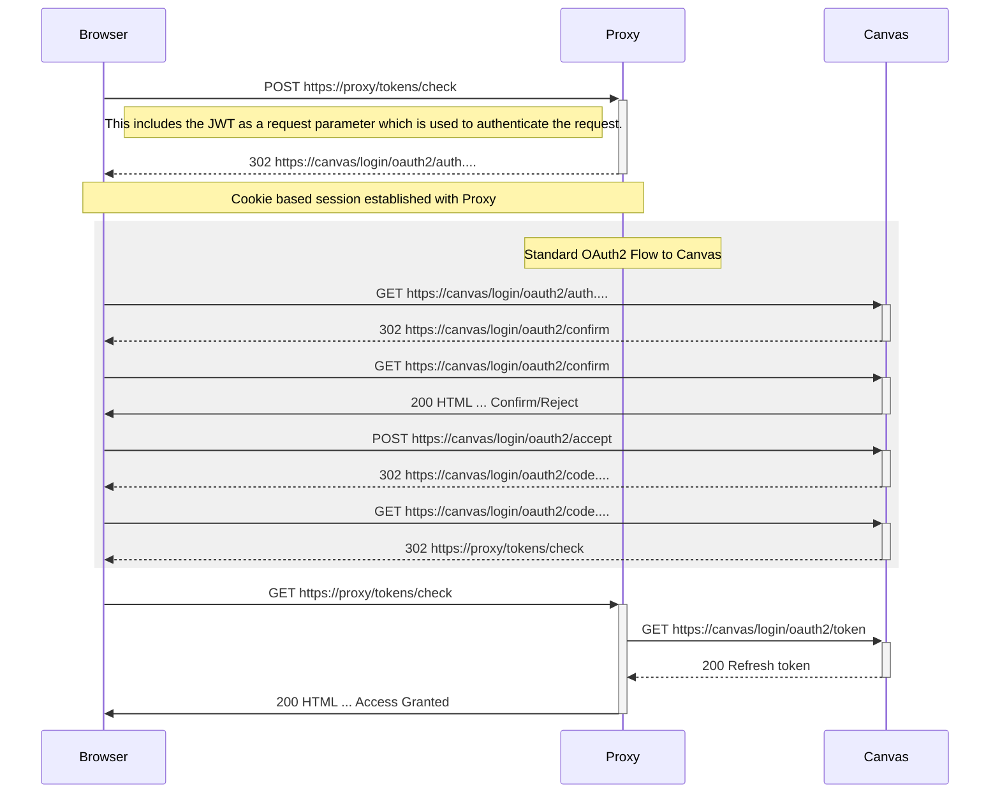

# Canvas Proxy

This is a simple webapp that just takes a HTTP request and proxies it through to Canvas. This allows a frontend webapp to be able to make XHR requests to Canvas. It should support multiple developer keys so that it can support multiple applications using it. It requests tokens for users from Canvas and then stores them in a database so that the next time the user uses the tool they don't have to re-grant the tool access.

The JWT (from the LTI launch) client ID is used to map to a developer API key to lookup tokens for the API requests to Canvas. This also maps to some configuration so we know the host to connect to (Canvas instance).

We also support serverside services having a shared secret key to sign requests (with HMAC) and this allows the services to perform requests once the JWT from the LTI launch has expired.

## Status

There is a small proxy controller that sends requests on the Canvas with a hard coded token. Headers get passed through and responses get passed back. At the moment there seems to be a bug with HTML responses.

## Usage

## Renewing a token for a user

The endpoint (badly named) to renew a token for a user is `POST /tokens/check`, this attempts to remove the existing token for a user and then gets them to re-grant access to the application. The sequence is as follows:

## Deployment Configuration

### AWS Elastic Beanstalk

This application needs a database to store the OAuth tokens it gets granted. Recovery for this database isn't critical at the moment as if wee lost it then everyone would need to confirm that they wanted to grant access to their account again. We have enabled swap on the instance so for test instances we can use low memory machines and still be able to deploy new version without running out of memory.

#### Environmental Variables

- HOSTNAME - The hostname that the server is running on, used to get TLS/config files.
- RDS_HOSTNAME - The MySQL hostname to connect to for the database.
- RDS_PORT - The MySQL port to use in the connection to thee database.
- RDS_DB_NAME - The name of the MySQL database to use.
- RDS_USERNAME - The username to use to connect to the MySQL database.
- RDS_PASSWORD - The password to use to connect to the MySQL database.

#### Client Configuration

For each client that can use the tool there needs to be an entry in the client configuration file. This file then needs to be updated to S3. To download the current clients:

    aws s3 cp s3://elasticbeanstalk-eu-west-1-211318693510/files/proxy.canvas.ox.ac.uk-client.properties .

then you can edit the file and upload it to S3 again:

    aws s3 cp proxy.canvas.ox.ac.uk-client.properties s3://elasticbeanstalk-eu-west-1-211318693510/files/

The client will probably also want to have it's HTTPS endpoint added to the CORS configuration in the same file. To add a new client first you need to decide on the "Client Registration ID" which is a name used by the spring configuration. This will form part of all the properties. For each client you need a section in the configuration like:

    # Replace [clientRegId] and [instance] with values for your tool
    # This first section can be shared if there are multiple tools
    spring.security.oauth2.client.provider.[instance].authorization-uri=https://[instance].instructure.com/login/oauth2/auth
    spring.security.oauth2.client.provider.[instance].token-uri=https://[instance].instructure.com/login/oauth2/token
    
    # This is the details of the tool
    # User friendly name of the registration.
    spring.security.oauth2.client.registration.[clientRegId].client-name=
    # The client ID from Canvas
    spring.security.oauth2.client.registration.[clientRegId].client-id=
    # The client secret from Canvas
    spring.security.oauth2.client.registration.[clientRegId].client-secret=
    spring.security.oauth2.client.registration.[clientRegId].redirect-uri={baseUrl}/login/oauth2/code/{registrationId}
    spring.security.oauth2.client.registration.[clientRegId].authorization-grant-type=authorization_code
    spring.security.oauth2.client.registration.[clientRegId].client-authentication-method=post
    spring.security.oauth2.client.registration.[clientRegId].provider=[instance]
    
Then you will also need a mapping from the LTI Key to the Developer Key

    # Set this equal to the client ID of the LTI tool.
    proxy.mapping.[ltiClientId].clientName=[clientRegId]

If you want to allow HMAC signed requests by a server also set:

    # An optional shared secret for signing HMAC JWTs.
    proxy.mapping.[ltiClientId].secret=[base64EncodedSecret]
    # The issuer that the service will use to sign the JWTs.
    proxy.mapping.[ltiClientId].issuer=[https://myservice.issuer]

#### HTTPS

A public private keypair needs to be generated for TLS. There are configurations for TLS in `proxy.canvas.ox.ac.uk.cfg` to create a new private key and CSR use:

    openssl req -nodes -new -keyout proxy.canvas.ox.ac.uk-key.pem -out proxy.canvas.ox.ac.uk.csr -config proxy.canvas.ox.ac.uk.cfg -batch -verbose

This CSR can then be used to request a certificate from the certificate service: https://wiki.it.ox.ac.uk/itss/CertificateService 
Once a certificate is issued they should be uploaded to the S3 bucket:

    aws s3 cp proxy.canvas.ox.ac.uk-chain.crt  s3://elasticbeanstalk-eu-west-1-211318693510/certificates/
    aws s3 cp proxy.canvas.ox.ac.uk-key.pem s3://elasticbeanstalk-eu-west-1-211318693510/certificates/

## TODO

### Different JWT Validator

live/beta/test have different JWTs, need different validators.

### Refresh/Access tokens

Handling refresh/access tokens and updating them in the DB, at the moment we have to re-ask every 1 hour.

### Error Handling

If the user removes their token then we get a 401 back from Canvas with a body of:
{"errors":[{"message":"Invalid access token."}]}
We need to be careful with this as when our JWT is invalid we will also get 401, one difference is that the error proxied from canvas is the header:

    WWW-Authenticate: Bearer realm="canvas-lms"

but when it's from an missing JWT it's:

     WWW-Authenticate: Bearer realm="proxy"
    
and if it's an invalid JWT it's something along the lines of:

    WWW-Authenticate: Bearer error="invalid_token", error_description="An error occurred while attempting to decode the Jwt: Signed JWT rejected: Another algorithm expected, or no matching key(s) found", error_uri="https://tools.ietf.org/html/rfc6750#section-3.1"

### Request Body

Need to test the handling of request bodies and if they get correctly mapped through the proxy to Canvas.

### Frontend from config

We need to pull the frontend application from configuration so that we can support multiple frontends.

## Releasing

To make a new release of this create a new tag using the maven release plugin. Normally this can be done using:

    mvn release:prepare

This will ask what then release version should be and then what the next development version should be. We try to follow semantic versioning for this. After the release plugin has finished it should push the changes to GitHub, then GitHub Actions will build the new tag a put a tagged image in the ECR repository. The release to production can then be made by running the production deploy GitHub Action and specifying the newly created tag. Afterwards all this can be cleaned up with:

    mvn release:clean
